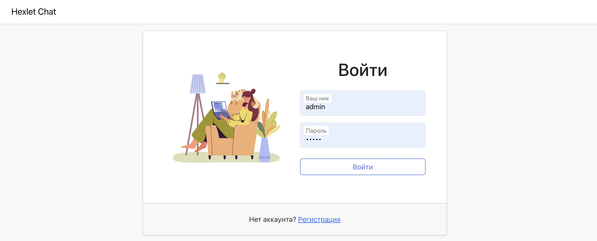
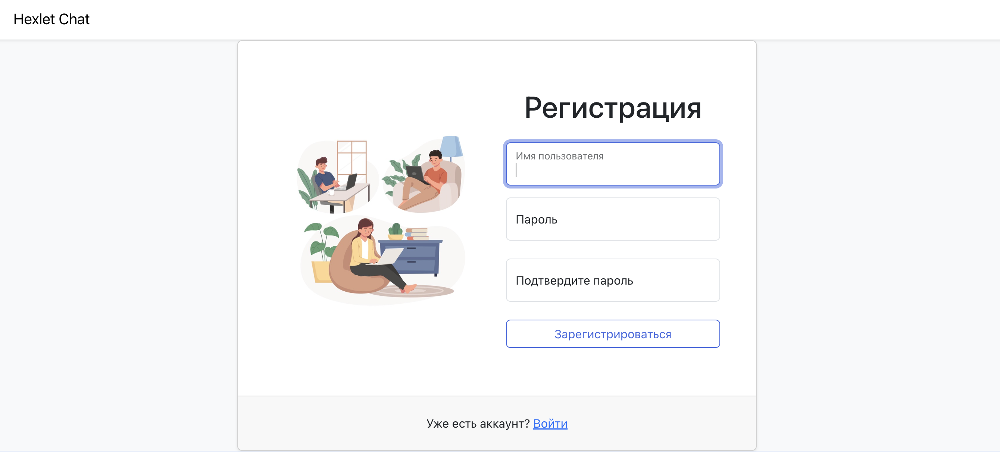
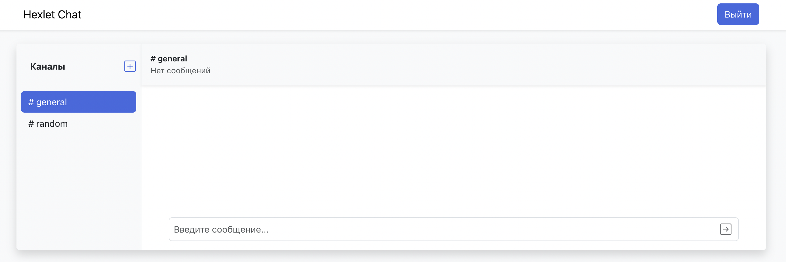
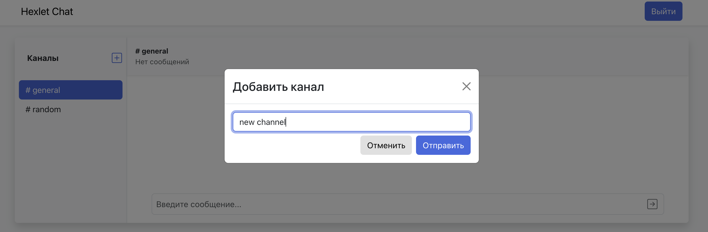
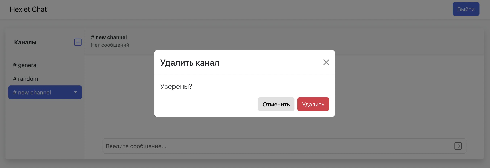
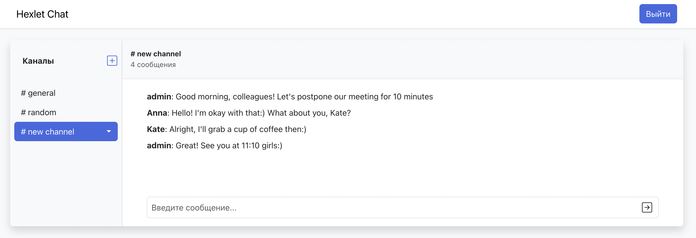

### Hexlet tests and linter status:
[](https://github.com/smotrivnebo11/frontend-project-12/actions)
[](https://codeclimate.com/github/smotrivnebo11/frontend-project-12/maintainability)
[](https://github.com/smotrivnebo11/frontend-project-12/actions/workflows/my-linter-check.yml)

## Hexlet Chat

Hexlet Chat is a simplified version of Slack, where you can send and receive messages in real time, create, delete and rename channels.

In this chat you receive pop-up notifications of user actions, obscene words are hidden by ***. 


## How to use it?

<code>[Click here to see the app in browser](https://hexlet-chat-uftm.onrender.com)</code> 
- Sign up with your own nickname and password or log in with the admin account

        - Login: `admin`
        - Password: `admin`


  - Send a message in the default channels (#general and #random)
  - Create a channel using ➕ button on the left side of the menu
  - Enjoy the pop-up notification of successful channel creation
  - Obsene words in messages and channel names are hidden by ***

## Demonstration

 ### Login page:
 

 ### Sign up page:
  

 ### Main page:
  

 ### Add channel:
  

 ### Delete channel:
  

 ### Chat page:
  

## Installation

 <span style="color:#59afe1"> **Developer installation:**</span>
 ```
 1. git clone https://github.com/smotrivnebo11/frontend-project-12
 2. make install
 3. make start
 ```

## Tech stack

- React / React Hooks - user interfaces
- Redux / Redux Toolkit - state container
- Bootstrap - CSS Framework
- Socket.io - WebSocket based browser-server communication
- Axios - HTTP requests
- Formik - building forms on React
- Yup - form validation
- I18next - manage text
- React-toastify - pop-up notifications
- Leo-profanity - profanity filter
- Rollbar - error tracking
